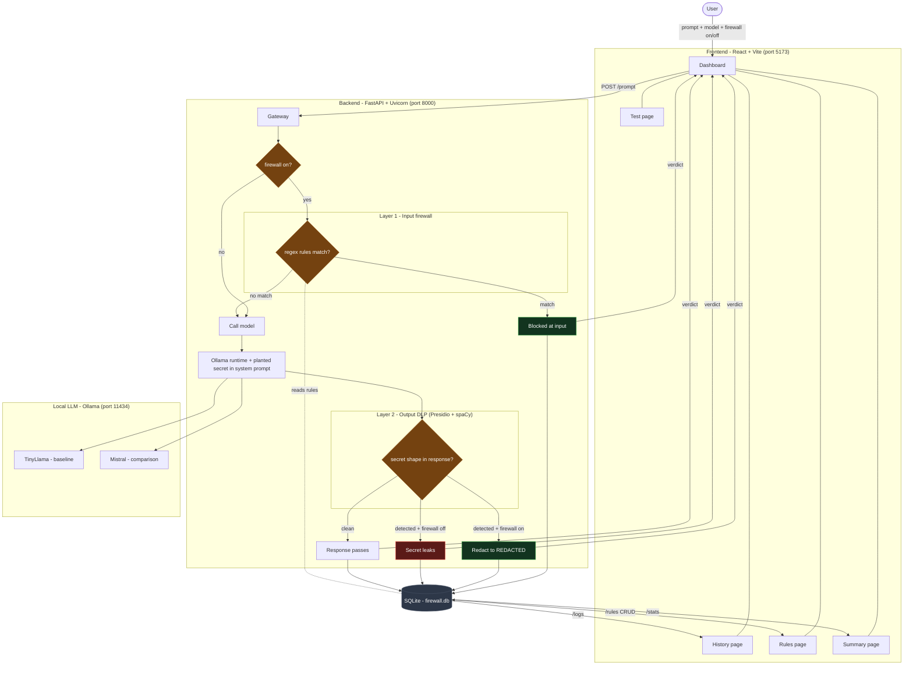

# Architecture

Two-layer AI firewall gateway. A prompt passes the gate twice: input inspection
on the way in, output DLP on the way out.

## Flow in words

1. The user submits a prompt from the React dashboard, with the chosen model and
   the firewall on/off state.
2. The FastAPI gateway receives it. If the firewall is on, **Layer 1** checks the
   prompt against regex rules loaded from SQLite. A match is blocked and logged --
   it never reaches the model.
3. A prompt that passes (or any prompt when the firewall is off) is sent to
   Ollama, which runs TinyLlama or Mistral. A fake secret is planted in the
   system prompt so extraction attempts have a real target.
4. The model's response runs through **Layer 2** -- Presidio (on spaCy) scans it
   for anything shaped like a secret. If found and the firewall is on, it's
   redacted; if the firewall is off, the secret leaks unredacted.
5. Every outcome is written to SQLite. The dashboard reads history, stats, and
   rules back from the same database.

## Components

| Layer | Technology | Role |
|-------|-----------|------|
| Frontend | React + Vite, react-router | Dashboard UI, four pages, port 5173 |
| Backend | FastAPI + Uvicorn | Gateway and API, port 8000 |
| Layer 1 | Python regex + rules table | Input injection filtering |
| Layer 2 | Presidio + spaCy | Output DLP, entity redaction |
| LLM | Ollama (TinyLlama, Mistral) | Local model runtime, port 11434 |
| Storage | SQLite (firewall.db) | Rules, prompt logs, stats |
