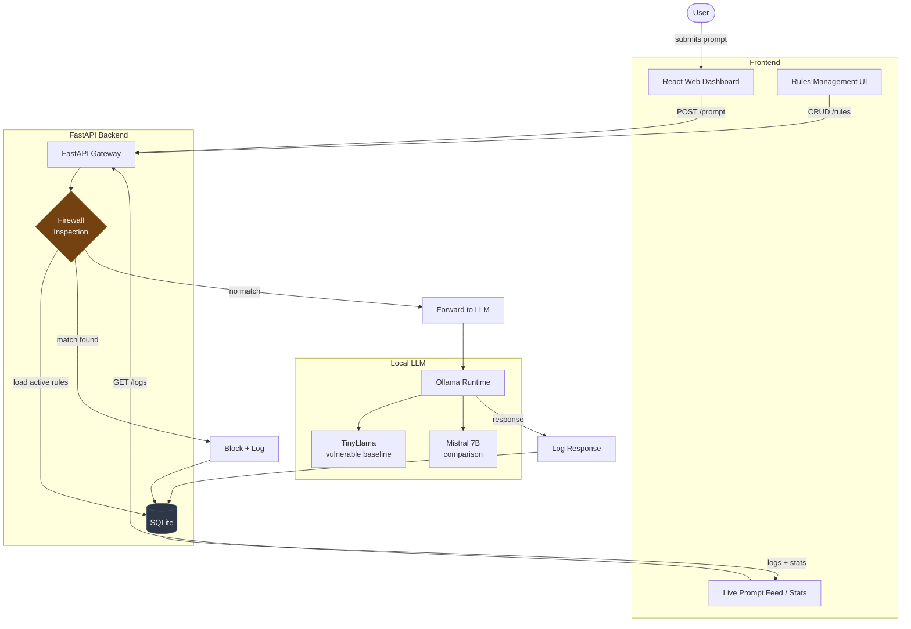

# Architecture

How a prompt flows through the AI firewall gateway.

## Flow summary

1. User submits a prompt through the React dashboard.
2. FastAPI gateway loads active rules from SQLite and inspects the prompt.
3. On a rule match, the request is blocked and logged.
4. Otherwise it's forwarded to Ollama (TinyLlama baseline or Mistral comparison).
5. The response is logged, and the dashboard reads logs and stats back from SQLite.
